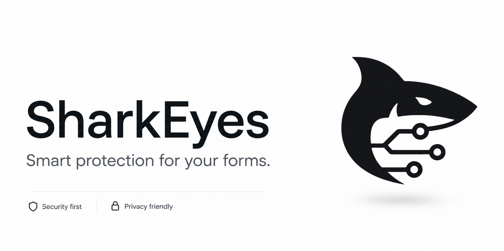

<div align="center">


# SharkEyes

**Security First. Privacy Always.**

Stop bots before they reach your forms — silently, accurately, and without friction.

[](https://sharkeyes.dev)
[](https://www.npmjs.com/package/sharkeyes)
[](https://pypi.org/project/sharkeyes)
[](LICENSE)

</div>

---

## What is SharkEyes?

SharkEyes is an intelligent bot protection service for web forms. Instead of annoying CAPTCHAs or puzzles, it silently analyzes request metadata to determine whether a submission comes from a real human or an automated bot — blocking threats before they ever reach your backend.

No cookies. No tracking. No user data stored beyond 24 hours.

---

## Features

- **Bot Detection** — Analyzes HTTP metadata, user agents, and request behavior to detect automated activity
- **Fight Mode** — Extra layer of protection against active, coordinated attacks
- **Anonymizer Blocking** — Blocks requests from known VPN providers and public proxy servers
- **Geo Blocking** — Restrict access by country (up to 100 rules)
- **IP Blocking & Whitelist** — Block or allow specific IPs and CIDR ranges
- **ASN Blocking** — Block entire autonomous systems (e.g. AS15169 — Google Cloud)
- **OS & User Agent Blocking** — Filter by operating system or user agent string (e.g. Googlebot)
- **Dashboard** — Clean, intuitive interface to manage all protection rules
- **Privacy First** — Only collects metadata required for verification. All data is permanently deleted after 24 hours

---

## Quick Start

### JavaScript / TypeScript

```bash
npm install sharkeyes
```

```js
import { SharkEyes } from 'sharkeyes';

const se = new SharkEyes({ apiKey: 'YOUR_API_KEY' });

const result = await se.verify(req);

if (!result.allowed) {
  return res.status(403).json({ error: 'Bot detected' });
}
```

### Python

```bash
pip install sharkeyes
```

```python
from sharkeyes import SharkEyes

se = SharkEyes(api_key="YOUR_API_KEY")

result = se.verify(request)

if not result.allowed:
    return {"error": "Bot detected"}, 403
```

### REST API

```bash
curl -X POST https://api.sharkeyes.dev/v1/verify \
  -H "Authorization: Bearer YOUR_API_KEY" \
  -H "Content-Type: application/json" \
  -d '{"ip": "1.2.3.4", "user_agent": "Mozilla/5.0..."}'
```

---

## Dashboard

Manage all your protection rules from a single place:

- Toggle Fight Mode and Anonymizer Blocking on/off
- Add/remove blocked countries, IPs, ASNs, and user agents
- Monitor verification activity in real time
- Manage multiple projects under one account

→ [dashboard.sharkeyes.dev](https://sharkeyes.dev)

---

## Privacy

SharkEyes is built with privacy as a core principle:

- Collects **only** the metadata necessary for bot verification
- **No cookies**, no fingerprinting, no personal data
- All collected data is **permanently deleted after 24 hours**
- Fully compliant with GDPR principles
- Made in 🇮🇱 Israel

---

## Pricing

| Plan | Price | Requests |
|------|-------|----------|
| Free | $0/mo | Limited |
| Pro  | $9/mo | Unlimited |

→ [View full pricing](https://sharkeyes.dev/price)

---

## Links

- [Website](https://sharkeyes.dev)
- [Documentation](https://sharkeyes.dev/docs)
- [Developers](https://sharkeyes.dev/developers)
- [Pricing](https://sharkeyes.dev/price)
- [Blog](https://sharkeyes.dev/blog)

---

<div align="center">
  <sub>Built with care. Security First. Privacy Always.</sub>
</div>
